  

 

  

## Tech Stack

<table>

<tr>
  <td align="center" width="96">
    
     Python
  </td>
  <td align="center" width="96">
    
     Java
  </td>
  <td align="center" width="96">
    
     C++
  </td>
  <td align="center" width="96">
    
     JavaScript
  </td>
  <td align="center" width="96">
    
     R
  </td>
  <td align="center" width="96">
    
     OpenCV
  </td>
</tr>

<tr>
  <td align="center" width="96">
    
     FastAPI
  </td>
  <td align="center" width="96">
    
     Node.js
  </td>
  <td align="center" width="96">
    
     Spring Boot
  </td>
  <td align="center" width="96">
    
     Spring Boot
  </td>
  <td align="center" width="96">
    
     Flask
  </td>
  <td align="center" width="96">
    
     REST API
  </td>
  <td align="center" width="96">
    
     Express.js
  </td>
</tr>

<tr>
  <td align="center" width="96">
    
     React
  </td>
  <td align="center" width="96">
    
     JavaScript
  </td>
  <td align="center" width="96">
    
     HTML
  </td>
  <td align="center" width="96">
    
     CSS
  </td>
  <td align="center" width="96">
    
     Tailwind
  </td>
  <td align="center" width="96">
    
     Vite
  </td>
  <td align="center" width="96">
    
     Docker
  </td>
  <td align="center" width="96">
    
     Git
  </td>
</tr>

<tr>
  <td align="center" width="96">
    
     AWS
  </td>
  <td align="center" width="96">
    
     GitHub
  </td>
  <td align="center" width="96">
    
     Linux
  </td>
  <td align="center" width="96">
    
     PostgreSQL
  </td>
  <td align="center" width="96">
    
     MongoDB
  </td>
  <td align="center" width="96">
    
     MySQL
  </td>
  <td align="center" width="96">
    
     SQLite
  </td>
  <td align="center" width="96">
    
     Firebase
  </td>
  <td align="center" width="96">
    
     Postman
  </td>
</tr>

</table>

  

🩺 MedScope

Evidence-grounded medical document assistant built with Python, FastAPI, React, LangChain, vector search and RAG.

🛒 ShopSphere

Full-stack e-commerce platform with Spring Boot, React, MySQL, JWT, Spring Security and Razorpay.

🏫 CampusCare

Role-based complaint management platform using Java, Spring Boot, React and MySQL.

🏋️ AI Fitness Coach

Real-time posture detection and exercise feedback using OpenCV and MediaPipe.

🔐 AuditX

AI and blockchain-assisted fraud detection prototype using FastAPI, React, Firebase and Solidity.

  

  

 

