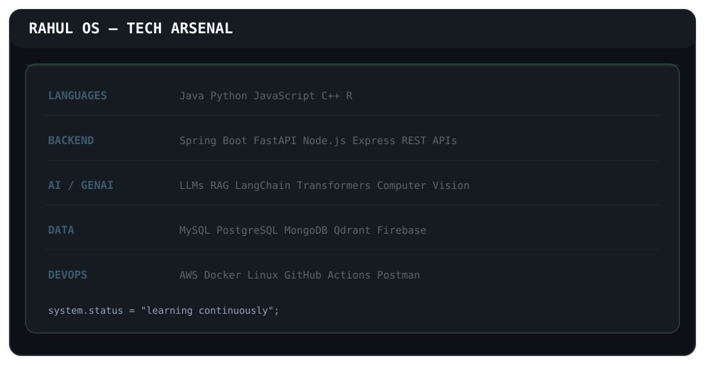

  

 

  

 Build Pipeline

  

  OS — Tech Arsenal

  

<b>Open complete technology inventory</b>

 

Languages: Java, Python, JavaScript, C++, RBackend: Spring Boot, FastAPI, Flask, Node.js, Express.js, REST APIsFrontend: React.js, HTML5, CSS3, JavaScript, ViteDatabases: MySQL, PostgreSQL, MongoDB, SQLite, Firebase, QdrantAI/ML: Machine Learning, Computer Vision, LLMs, RAG, LangChain, Hugging Face TransformersCloud & Tools: AWS, Docker, Linux, Git, GitHub, Postman, VS Code

 Featured Applications

  

<b>Read project details</b>

🩺 MedScope

Evidence-grounded medical document assistant built with Python, FastAPI, React, LangChain, vector search and RAG.

🛒 ShopSphere

Full-stack e-commerce platform with Spring Boot, React, MySQL, JWT, Spring Security and Razorpay.

🏫 CampusCare

Role-based complaint management platform using Java, Spring Boot, React and MySQL.

🏋️ AI Fitness Coach

Real-time posture detection and exercise feedback using OpenCV and MediaPipe.

🔐 AuditX

AI and blockchain-assisted fraud detection prototype using FastAPI, React, Firebase and Solidity.

🏆 Achievement Timeline

  

## Professional Journey

  

 GitHub Command Center

 

 Coding Profiles

 Learning Roadmap

  

 Let Us Connect

Have an idea worth building?

  

