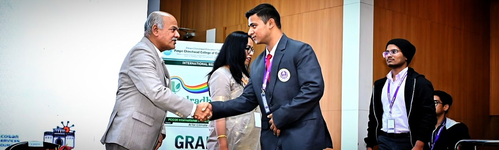

  

  <b>AI Engineer · Backend Developer · Systems & Database Engineering · Data Analytics & BI · Applied ML</b>

  <a href="https://rahultakale.vercel.app/">Portfolio</a> ·
  <a href="https://www.linkedin.com/in/rahultakale/">LinkedIn</a> ·
  <a href="mailto:rahultakale698@gmail.com">Email</a>

Hello I'm **Rahul Takale**, a final-year **B.Tech CSE (AI & Analytics)** student at **MIT Art, Design & Technology University**, Pune.
I enjoy building software that goes beyond model demos from **AI-powered applications and backend systems to databases and production-oriented engineering infrastructure**.

I also have a strong interest in **Data Analytics and Business Intelligence**, working with **Power BI, SQL, data visualization, data cleaning, and analytical reporting**. I am exploring **data mining, ETL workflows, data warehousing, and data-driven decision making** through analytics projects.

My current work includes building **SQL-based analytical solutions and Power BI dashboards**, transforming raw datasets into validated data models, KPIs, visualizations, and actionable insights.

My current focus is on building systems that are:

* **Reliable** : designed with clear abstractions and engineering discipline
* **Scalable** : built around APIs, caching, storage and modular architectures
* **Intelligent** : using ML, LLMs and retrieval where they actually add value
* **Measurable** : evaluated through benchmarks, latency and system metrics
* **Production-oriented** : tested, containerized and automated where possible

> **I like understanding what happens underneath the abstraction and then building it myself.**

---

<b>
Thank you for visiting! If you want to contribute, feel free to fork the repo, open an issue, or submit a pull request. 
Let's build something awesome together!
</b>

  

---
